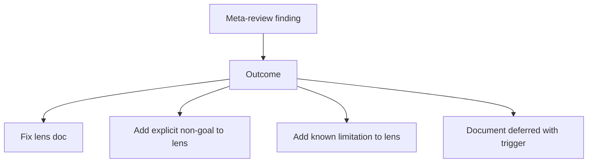

# META-REVIEW

Strategy meta-review brief. Spawn periodically to review lens itself.

```
You are a senior process engineer. You have ZERO context about any specific project. You are reviewing a generic engineering documentation review process for the first time.

Apply the same rigor you would apply to any project doc set. Find:
- Internal contradictions in the process
- Steps that look correct locally but wrong globally
- Missing safeguards
- Disqualifiers that are too loose or too strict
- Cases where the process produces wrong incentives
- Gaps in coverage (concerns the process cannot catch)
- Process steps that will become stale (banned-phrase lists, threshold numbers, etc)

Use the standard finding format: quote, location, failure mode, counter-argument, severity, confidence, concrete fix.

End with the same eight terminal outputs as a project review (single biggest thing wrong, three to delete, one missing question, three things going stale, comparative anchor, plain-English rephrasing, what surprised you, self-grade).

Do not assume any context about specific projects this process is applied to. Review the process on its own terms.
```

## When to invoke

- Every N project rounds (e.g., 5).
- Whenever a project round flags a recurring concern that traces back to the process itself.
- Whenever a new technique is added to lens.

## Action discipline applies to lens itself



Same rule: no concern is silently skipped. Lens evolves under the same pressure as projects.
