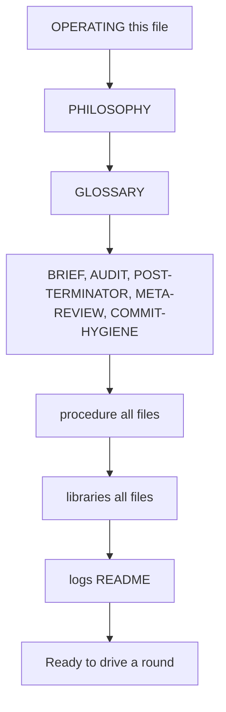
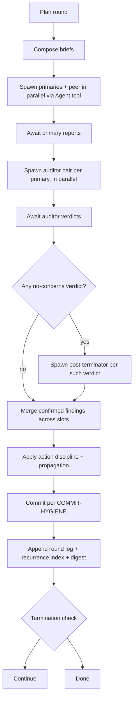

# OPERATING

Step-by-step runbook. Read this first if running a round.

## Mandatory reading rule

You (Claude, loop driver) must read every file in this repo yourself. Do not spawn a subagent to summarize. The whole repo is small and token-efficient on purpose. Read it whole.

## Mandatory reading order



After reading, you have full strategy context. Drive a round.

## What user might say to invoke

- "look at ~/lens, you'll know what's next"
- "run a round"
- "review my project at <path>"
- "review book" / "review <project name>"
- "continue the loop"
- "start a fresh round for <project>"
- "find bugs in <code path>"
- "audit security on <project>"
- "review the migrations under <path>"
- "find gaps in <subsystem>"

If the project path is not stated, ask. Lens reviews any artifact on disk. The canonical example is `~/tc/book` (a doc set).

## Target types

Lens runs the same loop on any of:
- Documentation set
- Source code (bug hunt, gap finding, security audit, perf review, test coverage audit)
- Infrastructure-as-code (manifests, Helm, Terraform)
- Schemas (DB migrations, proto, OpenAPI)
- Operational artifacts (runbooks, alert rules, dashboards)
- Mixed (code + its describing docs, to surface drift)

Scope in BRIEF is filled with file paths or directories of any of these types. Persona, theme, stress-tests are picked to match the target.

## Project prerequisites

The target must contain artifacts the reviewer can read. For doc reviews: the doc set. For code reviews: the source files in scope. For mixed: both. If the artifact set is empty or unreadable, lens has nothing to do; tell the user.

## First round vs continuing round

- **First round** for a project: no prior digest, no recurrence index, no calibration history. Create `logs/<project>/` subdirs as needed. Skip "calibration probe caught" termination criterion as vacuously satisfied. Write the first digest at end of round.
- **Continuing round**: read most recent `logs/<project>/digest.md` first to know what topics are predicted; use that to inform planning.

## Code-review pivot

The moment any project code lands (foundation app or otherwise), the next round's partition activates `Mixed code + docs` from `libraries/partitions.md`. One slot reads only docs, one only code, auditors compare drift. Doc-only rounds resume only if no code touched in the period. Prevents weeks of doc-perfection while reality diverges.

## Round mode

Every round is full per-round-exhaustive. No light/deep tiers. Token cost is not a concern. Apply every phase of [BRIEF](BRIEF.md), every auditor, the adversarial peer, three-scenario premortem, 2-3 stress tests. See [parallel-coverage](procedure/parallel-coverage.md).

## Vacuous-criterion rules

For [termination](procedure/termination.md):
- Calibration-probe-caught criterion is satisfied vacuously if no probe was inserted in the terminating rounds.
- Two-provider criterion: if only one provider is available, termination requires four consecutive nit-only rounds instead of two, with explicit caveat in the round log.

## Round execution



## Step-by-step

### Plan the round

- Pick partition scheme from [libraries/partitions](libraries/partitions.md). One slot per disjoint slice.
- For each slot: pick persona from [libraries/personas](libraries/personas.md) matching the slice.
- Pick a round-wide theme from [libraries/themes](libraries/themes.md).
- Pick 2-3 stress-tests from [libraries/stress-tests](libraries/stress-tests.md), matched to theme.
- Decide variant per slot: plain / steel-man-first / adversarial-framing.
- Decide whether to insert calibration probes per [libraries/calibration-probes](libraries/calibration-probes.md). Periodic, not every round.
- Assign a model + provider per slot per [procedure/reviewer-model-selection](procedure/reviewer-model-selection.md), rotating providers per [procedure/cross-provider](procedure/cross-provider.md).

### Compose briefs

Take the [BRIEF](BRIEF.md) template, fill `[PERSONA]`, `[SCOPE]`, `[THEME]`, `[STRESS_TESTS]` per slot. Append steel-man or adversarial framing if chosen. Verify no banned phrases or loop-language leaked.

### Spawn primaries in parallel

Use Claude Code's Agent tool. One Agent call per slot. Send all in a single message so they run concurrently. `subagent_type` = general-purpose. `prompt` = the filled brief content. `description` = short label.

Also spawn one adversarial full-context peer per [procedure/adversarial-full-context-peer](procedure/adversarial-full-context-peer.md), brief from that doc.

### Await primary reports

When all primary agents return, collect their reports.

### Spawn auditor pair per primary in parallel

For each primary report, spawn:
- One rule-compliance auditor (brief from [AUDIT](AUDIT.md) pass one)
- One fact-check auditor (brief from [AUDIT](AUDIT.md) pass two)

Different provider than primary when possible. All auditor calls in parallel where feasible.

### Apply post-terminator if any no-concerns verdict

For every primary or peer that returned no-concerns, spawn one post-terminator agent per [POST-TERMINATOR](POST-TERMINATOR.md). If post-terminator finds a concern, treat it as a real finding for the round; if "Verdict confirmed", verdict counts toward [procedure/termination](procedure/termination.md).

### Merge

Collect findings that were both rule-confirmed and fact-confirmed (or fact-n/a). Merge findings sharing root cause into root-level meta-findings.

### Apply action discipline + propagation

For each confirmed finding, in order:
1. Pick outcome: fix / non-goal / known-limitation / deferred.
2. Find root cause; if shared, fix root once.
3. Sweep all docs for same pattern; pre-emptively address.
4. Address topic family neighbors in same commit.
5. If non-goal: forward-expand to defeat related concerns.
6. Resolution review pass: does the fix or non-goal actually close the failure mode?
7. Apply edit to owning doc.

Mandatory: at least one delete or non-goal addition per round.

### Commit

Per [COMMIT-HYGIENE](COMMIT-HYGIENE.md). Smallest unit of meaningful work. No loop language. No AI-coauthor mention.

### Log

Append to project's lens log files per [logs/README](logs/README.md). Update recurrence index per [procedure/recurrence-index](procedure/recurrence-index.md). Write round digest per [procedure/convergence](procedure/convergence.md).

### Termination check

Per [procedure/termination](procedure/termination.md). If terminated, declare loop complete for current scope; resume on scope extension.

## Tool-use rules

- **Agent tool** spawns reviewer/auditor/peer agents. Use multi-tool-use in a single message for parallel slots.
- **WebSearch / WebFetch** are available in subagents (general-purpose). Auditor (fact-check) uses these to fetch URLs. Brief explicitly tells reviewers to use web tools for verification.
- Loop driver (you) does not personally fact-check after auditors return. Trust the auditor verdicts.
- Loop driver edits project docs and commits using Edit / Write / Bash tools.

## Concrete Agent tool invocation

For each slot, one Agent tool call. All parallel calls in a single message:

- `subagent_type`: "general-purpose"
- `description`: short label like "Auth scope review" or "Fact-check primary 3"
- `prompt`: the filled brief content as a single string. Include all phases, the persona block, the chosen theme, the stress tests, and any variant prefix.

Auditors receive the primary's report inside their prompt. Pass the primary's report as a section of the prompt body.

Post-terminator and meta-review use the same Agent tool with the corresponding brief from POST-TERMINATOR or META-REVIEW.

## Mermaid render check on project edits

When applying fixes to project docs, run `bash ~/lens/scripts/check-mermaid.sh <changed-files>` after edits and before commit. If the project has its own copy of the script that's fine; otherwise use lens's. Failure blocks commit.

## Recovery rules

- **Reviewer agent errors**: retry once with the same brief. Second failure: drop that slot for this round, log the failure under provider-bias, continue with remaining slots.
- **Auditor errors**: same retry rule. If both retries fail, treat the unaudited finding as fabrication-risk and drop.
- **User pauses round mid-flight**: leave any partial state in the lens logs but do not commit project changes until all slots return. On resume, restart from the last completed step.
- **Project repo in broken state** (uncommitted changes, conflicts): refuse to start a round. Report state and ask the user.

## Filled brief example

Persona = principal engineer (broad architecture). Scope = a project's PHILOSOPHY + STACK + ARCHITECTURE only. Theme = what contradicts what. Stress-tests = "You ship Monday" + "100k DAU on launch day". Variant = plain.

Replace `[PERSONA]`, `[SCOPE]`, `[THEME]`, `[STRESS_TESTS]` in BRIEF accordingly. The result is a self-contained prompt. Send as the Agent tool's `prompt`.

## Common pitfalls (avoid these)

- **Spawning a subagent to summarize lens.** Forbidden. Read lens yourself.
- **Forgetting to commit per round.** Round is incomplete until commits land.
- **Skipping fact-auditor.** Always spawn it. No conditional skip.
- **Forgetting to check for adversarial peer no-concerns.** Termination requires peer also returns no-concerns; do not advance counter without it.
- **Re-debating a recurring concern.** Doc clarity failure; rewrite the resolution, do not argue.
- **Mentioning loop in commits.** Hygiene-banned. Commit reads as if first contact.
- **Skipping the round digest.** Convergence depends on it. Write per [procedure/convergence](procedure/convergence.md).
- **Personally fact-checking after auditors.** Wastes effort. Trust the auditor pair.

## Autonomous workflow

The loop driver runs autonomously round after round until termination. Do not report progress between rounds. Do not narrate. Just keep looping.

### When to stop and ask

Stop only when a decision genuinely requires the user. Examples:
- Strategic pivots (scope, target market, hosting choice the team didn't pre-commit to)
- Trade-offs the team has not previously expressed a philosophy on
- Cost / time / business decisions outside engineering
- Conflicts between two prior locked decisions that need resolving

Do not stop for:
- Tech decisions covered by philosophy or prior locks
- Doc-level cleanups
- Action-discipline applications
- Routine reviewer findings

### When stopping, surface only the decision

The user sees only what they need to decide. Banned in stopping messages:
- Synthesis tables of all reviewer findings
- Lists of autonomous actions you plan to take
- Round summaries
- Cluster overviews
- Anything the user does not need to act on

Allowed in stopping messages:
- The decision itself with concise context
- MCQ options with pros/cons and recommendation per format below
- Nothing else

After the user picks, resume autonomously without re-narrating what you will do next. Just do it.

### MCQ format when stopping

```
# Concise question

Brief context (1-2 lines).

## A) Option A
- pros
- cons

## B) Option B
- pros
- cons

## My recommendation: X

Why X over alternatives in one sentence.

Pick A / B / ...?
```

Always include pros, cons, your recommendation, and a one-sentence rationale. Skip ceremony.

### When termination is reached

Report once at termination. Summarize: rounds run, total findings resolved, top recurrence-resolved topics, any caveats. Then stop.

## Resuming after compact or fresh session

If the user says "look at ~/lens, you'll know what's next", do:
1. Read every file in the repo yourself, in the order shown above.
2. Confirm context: pick up the most recent round digest from `logs/<project>/digest.md` if it exists.
3. Plan next round per the digest's "predicted topics".
4. Execute the runbook.
