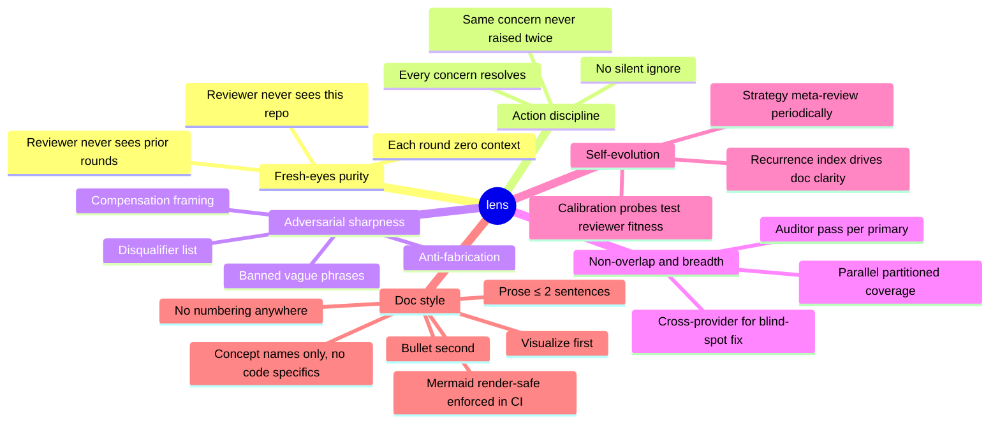
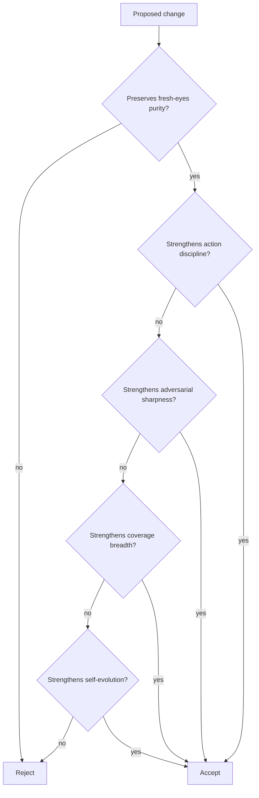

# PHILOSOPHY

Why the loop works. What it must preserve.

## Principles

## Decision filter for any change to lens itself

## Mermaid render-safe rules

GitHub renders an older mermaid version than mermaid.live; treat GitHub as ground truth. Render-check enforced in CI; pre-commit hook blocks bad blocks locally.

- No ` ` in node labels. Collapse to spaces or split into multiple shorter nodes.
- No inner double quotes inside any node shape. Rephrase without quotes.
- No raw special chars (`&`, `#`, `<`, `>`, `(`, `)`, `,`, `:`, `;`) in unquoted labels.
- No reserved keywords as node IDs.
- No spaces in node IDs. Spaces allowed only in labels.
- Edge labels need spaces around dashes.
- Subgraph titles with spaces require explicit `id [Display Name]` form.
- Mindmap root must be `((root))`; other shapes break.
- No markdown links inside any mermaid block. Mermaid parses node text as labels, not markdown.
- Sequence participant names with spaces require `participant ID as Display Name`.
- `stateDiagram-v2` and `stateDiagram` have different syntax; do not mix.
- HTML entities other than basic ones render unevenly. Avoid.

## Inviolable rules

- Reviewer agents must never see this repo. Loop driver only.
- Every confirmed finding resolves into fix, non-goal, known-limitation, or deferred-with-trigger. No silent skip.
- Same concern is never re-litigated. If it recurs, the artifact clarity failed; rewrite the artifact, do not re-debate. (For code targets: the artifact is the code or its test/comment; for doc targets: the doc text.)
- Commit messages and project docs never reveal loop awareness.
- "No concerns" is a respected outcome. Manufactured findings are forbidden.

## Self-application

This repo's own docs are subject to lens. Periodic strategy meta-reviews evaluate the strategy itself.
