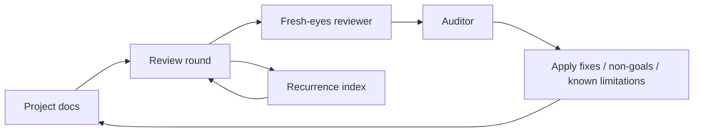

# lens

Adversarial fresh-eyes review loop for engineering documentation.



Reviewer agents must never read this repo. Loop driver only.

## Map

```mermaid
mindmap
  root((lens))
    Foundations
      [PHILOSOPHY](PHILOSOPHY.md)
      [BRIEF](BRIEF.md)
      [AUDIT](AUDIT.md)
      [POST-TERMINATOR](POST-TERMINATOR.md)
      [META-REVIEW](META-REVIEW.md)
      [COMMIT-HYGIENE](COMMIT-HYGIENE.md)
    Libraries
      [personas](libraries/personas.md)
      [themes](libraries/themes.md)
      [stress-tests](libraries/stress-tests.md)
      [partitions](libraries/partitions.md)
      [calibration-probes](libraries/calibration-probes.md)
    Procedure
      [round-flow](procedure/round-flow.md)
      [parallel-coverage](procedure/parallel-coverage.md)
      [action-discipline](procedure/action-discipline.md)
      [cross-provider](procedure/cross-provider.md)
      [recurrence-index](procedure/recurrence-index.md)
      [termination](procedure/termination.md)
    Logs
      [logs/](logs/README.md)
```

## Use

Start with [PHILOSOPHY](PHILOSOPHY.md). Then [BRIEF](BRIEF.md). Then run a round per [round-flow](procedure/round-flow.md).
