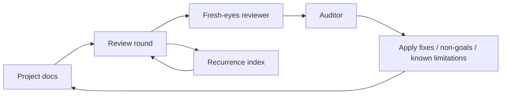
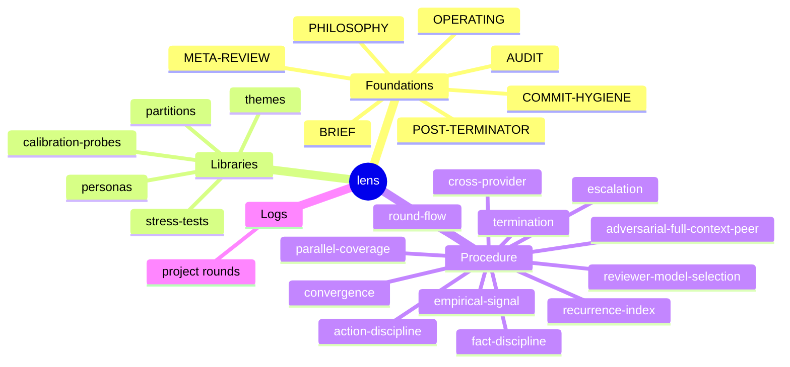

# lens

Adversarial fresh-eyes review loop for engineering documentation.

Reviewer agents must never read this repo. Loop driver only.

If you (Claude, loop driver) just landed in this repo, start with [OPERATING](OPERATING.md). Read every file yourself; do not spawn a subagent to summarize.

## Map

Files:
- [OPERATING](OPERATING.md) — start here if running a round
- [PHILOSOPHY](PHILOSOPHY.md) — values
- [BRIEF](BRIEF.md) — primary reviewer brief template
- [AUDIT](AUDIT.md) — auditor brief
- [POST-TERMINATOR](POST-TERMINATOR.md) — verdict-disprove brief
- [META-REVIEW](META-REVIEW.md) — strategy meta-review brief
- [COMMIT-HYGIENE](COMMIT-HYGIENE.md) — commit message rules
- libraries: [personas](libraries/personas.md), [themes](libraries/themes.md), [stress-tests](libraries/stress-tests.md), [partitions](libraries/partitions.md), [calibration-probes](libraries/calibration-probes.md)
- procedure: [round-flow](procedure/round-flow.md), [parallel-coverage](procedure/parallel-coverage.md), [action-discipline](procedure/action-discipline.md), [convergence](procedure/convergence.md), [cross-provider](procedure/cross-provider.md), [recurrence-index](procedure/recurrence-index.md), [escalation](procedure/escalation.md), [termination](procedure/termination.md), [empirical-signal](procedure/empirical-signal.md), [reviewer-model-selection](procedure/reviewer-model-selection.md), [adversarial-full-context-peer](procedure/adversarial-full-context-peer.md), [fact-discipline](procedure/fact-discipline.md)
- [logs](logs/README.md) — per-project round logs

## Use

Read [OPERATING](OPERATING.md) first. Then read every other file in this repo yourself. Then run a round.
