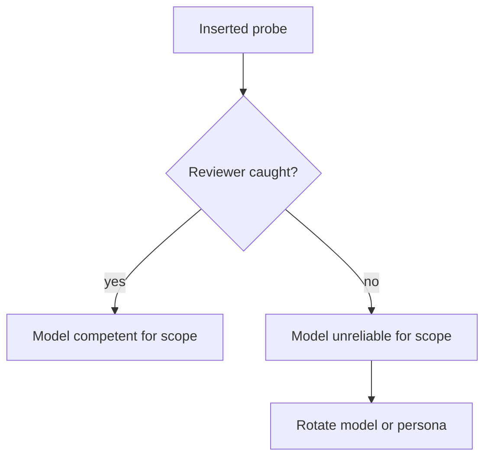

# calibration-probes

Calibration probes test whether the reviewer model is competent for the assigned scope.

## Method

- Insert deliberate small errors into the project docs before sending to a reviewer.
- If the reviewer catches them, the model is competent for this scope.
- If the reviewer misses them, model findings on this scope are unreliable; rotate model or persona.
- Remove probes after the round closes.

## Probe categories

- **Typo probe**: change a single character in a citation (e.g., RFC number) so the citation no longer resolves. Reviewer should catch via verification.
- **Internal contradiction probe**: insert a sentence that contradicts another section. Reviewer should catch via contradiction detection.
- **Wrong-cite probe**: claim that a regulation requires X when it requires Y. Reviewer should catch via external verification.
- **Stale-version probe**: claim a tool version that does not exist. Reviewer should catch via external verification.
- **Dead-link probe**: cite a URL that returns 404 if fetched. Reviewer should catch if it actually verifies.
- **Domain-knowledge probe**: state a known-correct domain fact in the brief and require the reviewer to reason consistent with it. Tests priors, not just rule compliance. If reviewer's findings contradict the known fact, model lacks priors for this scope.
- **Planted-wrong-evidence probe**: insert a fabricated URL or wrong regulation citation into the brief or the project docs. If reviewer accepts the planted evidence and uses it in a finding, the model has no fact-checking instinct. If reviewer challenges or ignores it, fact-discipline is healthy.

## Probes for code targets

- **Planted bug probe**: insert a deliberate off-by-one, null deref, race, leaked resource, or unhandled error path into the code under review. Reviewer should catch.
- **Planted security flaw probe**: hardcoded secret, missing auth check, unvalidated input, weak crypto, log-leaked PII. Reviewer with security-auditor persona should catch.
- **Planted regression probe**: weaken an existing test assertion or remove a guard check. Reviewer with test-reviewer persona should catch.
- **Planted dead code probe**: introduce a function never called from any reachable path. Reviewer should flag as dead.
- **Planted drift probe**: mutate code so it contradicts its describing doc (when running mixed code+doc partitions). Reviewer should surface drift.

## Use frequency

Not every round. Periodic. Every N rounds (e.g., 3-5).

## Privacy

Probes themselves are not committed to the project repo. Loop driver inserts at brief-send time, removes after. Probes' nature stays in this repo.

## Outcomes

