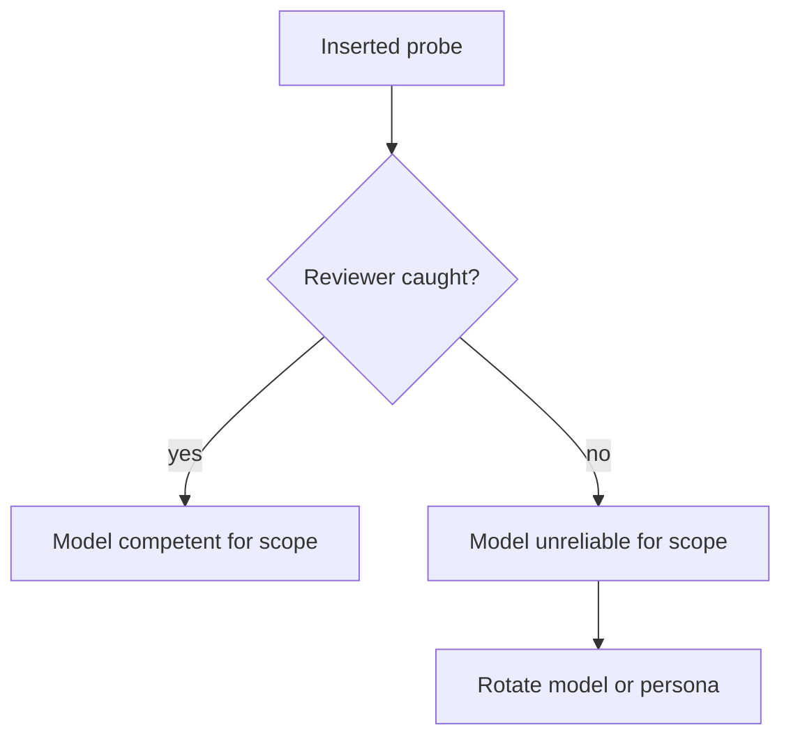

# calibration-probes

Calibration probes test whether the reviewer model is competent for the assigned scope.

## Method

- Insert deliberate small errors into the project docs before sending to a reviewer.
- If the reviewer catches them, the model is competent for this scope.
- If the reviewer misses them, model findings on this scope are unreliable; rotate model or persona.
- Remove probes after the round closes.

## Probe categories

- **Typo probe**: change a single character in a citation (e.g., RFC number) so the citation no longer resolves. Reviewer should catch via verification.
- **Internal contradiction probe**: insert a sentence that contradicts another section. Reviewer should catch via contradiction detection.
- **Wrong-cite probe**: claim that a regulation requires X when it requires Y. Reviewer should catch via external verification.
- **Stale-version probe**: claim a tool version that does not exist. Reviewer should catch via external verification.
- **Dead-link probe**: cite a URL that returns 404 if fetched. Reviewer should catch if it actually verifies.

## Use frequency

Not every round. Periodic. Every N rounds (e.g., 3-5).

## Privacy

Probes themselves are not committed to the project repo. Loop driver inserts at brief-send time, removes after. Probes' nature stays in this repo.

## Outcomes

