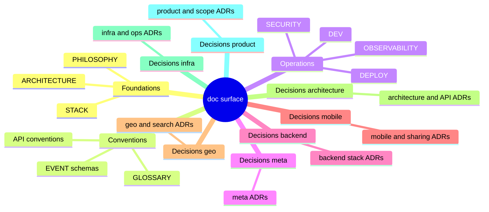

# partitions

Doc-surface partition schemes for parallel non-overlapping coverage. Pick one scheme per parallel round. Rotate across rounds.

## By doc category

Each leaf becomes one reviewer slot.

## By concern axis (cross-cutting)

- Reviewer: contradictions across all docs
- Reviewer: SSOT violations across all docs
- Reviewer: missing-content gaps
- Reviewer: cost realism
- Reviewer: regulatory exposure
- Reviewer: failure-mode imagination
- Reviewer: doc-style violations of the project's philosophy

Cross-cutting partitions rotate the lens, not the surface.

## Partition rules

- Each reviewer covers a disjoint slice. No two reviewers see the same primary doc as their owned scope.
- Cross-cutting docs (PHILOSOPHY, README, GLOSSARY) may be referenced by all but owned for review by exactly one.
- Persona of each reviewer matches the slice (compliance lawyer for SECURITY, iOS reviewer for mobile ADRs, SRE for DEPLOY).
- Theme and stress-tests can differ per reviewer in the same round.
- Auditor accompanies each primary one-to-one.

## Periodic full-fresh full-scope

Partitioned rounds risk missing cross-partition issues. Every N partitioned rounds, run one round with a single reviewer covering the entire doc set, no partition. Catches what disjoint coverage cannot see.
