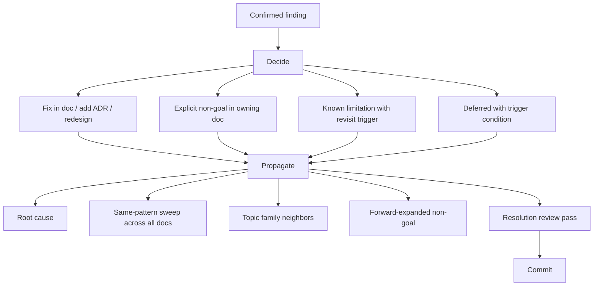

# action-discipline

Every confirmed finding resolves into one of four outcomes. Never silently skipped. Every resolution propagates.

## Outcome rules

| Outcome | When |
|---------|------|
| Fix | Team agrees the finding is correct; doc must change |
| Non-goal | Team disagrees; intentionally chooses the criticized path; non-goal stated in owning doc |
| Known limitation | Concern is real but accepted as bounded trade-off; limitation stated with revisit trigger |
| Deferred | Address later; trigger condition stated |

## Propagation rules (mandatory per finding)

- **Root-cause batch**: N findings sharing a root → fix root once.
- **Same-pattern sweep**: scan all docs for the pattern; fix proactively.
- **Topic family**: address neighbors in same family within the same commit.
- **Forward-expanded non-goal**: when stating a non-goal, also state related concerns it implicitly defeats.
- **Resolution review**: sanity-check internally that the fix or non-goal actually closes the failure mode, not rewrites around it. Reject resolutions that don't close.

## No-re-litigation

A re-raised concern that was previously resolved means the resolution text is not unmissable. Rewrite the resolution. Do not re-debate the concern. Repeat re-raise becomes a finding about doc clarity, not the original topic.

## Where outcomes live

- Fix: in the doc containing the criticized passage.
- Non-goal: in the doc that owns the topic, inline.
- Known limitation: in the owning doc, clearly labeled section.
- Deferred: in the owning doc, with trigger condition.

Never in a separate review-concerns log inside the project repo. That betrays loop awareness.

## Subtractive pressure per round

Each round attempts one deletion or one non-goal addition. Counter for monotonic doc growth.

Not a hard mandate. Manufactured subtractions are forbidden under the same rule that forbids manufactured findings. If a round has genuinely nothing earning removal and no non-goal honestly defeats a re-raise pattern, log "no subtraction this round, rationale: X" in the round log. Same vacuous-criterion shape as calibration probes.

Every N rounds (default 5) the round's primary theme is `Pure deletion round` from `libraries/themes.md`. Batches honest subtraction instead of forcing one-per-round.

Bloat signal tracked in `empirical-signal.md` (paragraph count, ADR count, total bytes). Crossing a threshold forces a deletion-themed round regardless of cadence.
