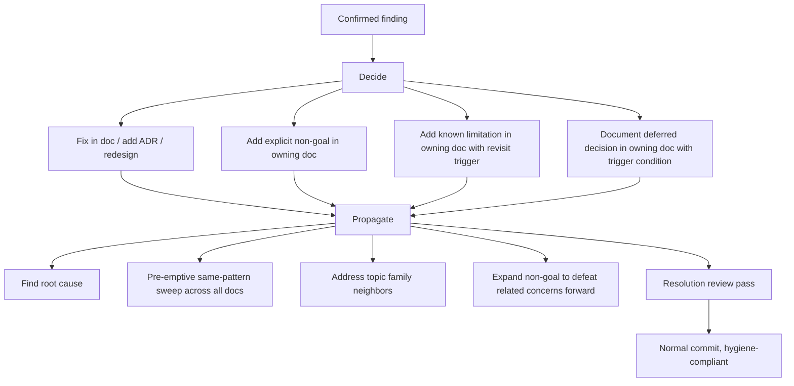

# action-discipline

Every confirmed finding from any reviewer round resolves into exactly one outcome. Never silently skipped. Every resolution propagates to root cause, same-pattern siblings, topic family neighbors, and forward-defeating non-goals.

## Outcome rules

| Outcome | When |
|---------|------|
| Fix | The team agrees the finding is correct and the doc must change |
| Non-goal | The team disagrees with the finding and intentionally chooses the criticized path; non-goal stated in owning doc directly |
| Known limitation | The team agrees the concern is real but accepts it as a bounded trade-off; limitation stated with revisit trigger |
| Deferred with trigger | The team agrees to address it later; trigger condition stated explicitly |

## Propagation rules (mandatory, applied to every confirmed finding)

### Root-cause batch resolution
If N findings share a root cause, fix the root once. Do not apply N separate per-symptom fixes.

### Pre-emptive same-pattern sweep
When fixing finding X in doc A, scan every doc for the same pattern. Fix proactively. Catches what fresh-eyes would raise next round before they do.

### Topic family clustering
Group findings into topic families (realtime, auth, regulatory, doc style, etc). When one family member is addressed, scan the family for neighbors and address them in the same commit. Closes a cluster, not a single concern.

### Forward-expanded non-goal
When adding a non-goal, also state related concerns the non-goal implicitly defeats. Future rounds see the broader non-goal scope and do not re-raise neighbor concerns.

### Resolution review pass
Before applying any resolution, sanity-check internally: does this fix or non-goal actually close the concern, or does it rewrite around it without addressing the failure mode? Reject resolutions that don't close.

## The no-re-litigation rule

If a future fresh-eyes reviewer raises the same concern that was previously resolved, the doc has failed to communicate the resolution clearly enough. Rewrite the resolution to be unmissable. Do not re-debate the concern.

If the concern is raised twice in the same form despite explicit non-goal, that is a finding about doc clarity, not a finding about the original concern.

## Where outcomes live

- Fix: in the doc that contains the criticized passage
- Non-goal: in the doc that owns the topic; not in a separate non-goals file
- Known limitation: in the doc that owns the topic, in a clearly labeled section
- Deferred: in the doc that owns the topic, with the trigger condition stated

Never in a separate review-concerns log within the project repo. That would betray loop awareness.

## Mandatory delete or non-goal per round

Every round produces at least one deletion or one non-goal addition, not just additions. Counter for doc bloat.

## Convergence is the goal

Every propagation rule exists to gain maximum value per round and converge in fewer rounds. A finding that closes only itself wastes the round's signal. A finding whose resolution closes its root cause, sibling patterns, family neighbors, and forward-related concerns earns the round.
