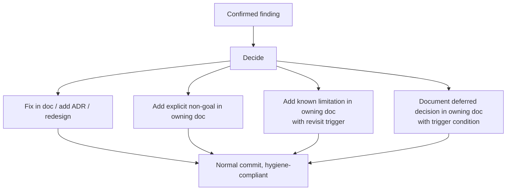

# action-discipline

Every confirmed finding from any reviewer round resolves into exactly one outcome. Never silently skipped.

## Outcome rules

| Outcome | When |
|---------|------|
| Fix | The team agrees the finding is correct and the doc must change |
| Non-goal | The team disagrees with the finding and intentionally chooses the criticized path; non-goal stated in owning doc directly |
| Known limitation | The team agrees the concern is real but accepts it as a bounded trade-off; limitation stated with revisit trigger |
| Deferred with trigger | The team agrees to address it later; trigger condition stated explicitly |

## The no-re-litigation rule

If a future fresh-eyes reviewer raises the same concern that was previously resolved into a non-goal, known-limitation, or deferred outcome, the doc has failed to communicate the resolution clearly enough. Action: rewrite the resolution in the doc to be unmissable. Do not re-debate the concern itself.

If the concern is raised twice in the same form despite explicit non-goal, that is a finding about the doc clarity, not a finding about the original concern.

## Where outcomes live

- Fix: in the doc that contains the criticized passage
- Non-goal: in the doc that owns the topic; not in a separate "non-goals" file
- Known limitation: in the doc that owns the topic, in a clearly labeled section
- Deferred: in the doc that owns the topic, with the trigger condition stated

Never in a separate "review concerns log" within the project repo. That would betray loop awareness.

## Mandatory delete or non-goal per round

Every round must produce at least one deletion or one non-goal addition, not just additions. Counter for doc bloat.
