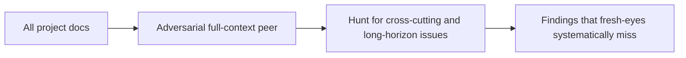

# adversarial-full-context-peer

Counter-balance to fresh-eyes-only review. One reviewer per round has full project context and explicitly hunts what fresh-eyes systematically miss.

## Why

Fresh-eyes reviewers are good at surface-level contradictions and missing pieces. They are weak at:
- Cross-cutting issues that span many docs and require holding the whole picture
- Long-horizon consequences invisible without history
- Conventions that are correct in isolation but wrong as a set
- Decisions that look right one ADR at a time but produce a bad whole

Fresh-eyes alone leaves these blind spots untested. The adversarial peer fills the gap.

## Role definition



## Brief addition

Send this as the peer brief, distinct from primary fresh-eyes brief.

```
You have FULL context about this project. You have read everything. Your job is to find what fresh-eyes reviewers systematically miss:

- Cross-cutting issues that span many docs and require holding the whole picture
- Long-horizon consequences invisible without history
- Conventions that are correct in isolation but wrong as a set
- Decisions that look right one at a time but produce a bad whole
- Coupling between distant docs that is not explicit anywhere
- Implicit assumptions that work today but won't survive a specific change

Apply the same finding format and disqualifiers as the primary brief. Apply the defeat-the-non-goal rule. Cite real-world precedent for architectural findings.

Your findings must be ones a fresh-eyes reviewer with the same scope would not produce. If your finding is something a fresh-eyes reviewer would also catch, drop it.
```

## Cadence

One peer review per round, paired with the parallel fresh-eyes reviewers. Auditor pairs with peer the same as with primaries.

## Termination interaction

A peer-found concern counts as a real finding. The terminator counter does not advance until peer also returns "No concerns" for the round.
