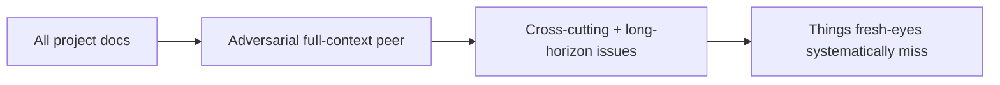

# adversarial-full-context-peer

Counter-balance to fresh-eyes-only review. One reviewer per round has full project context and explicitly hunts what fresh-eyes systematically miss.



## Brief

```
You have FULL context about this project. You have read everything. Your job is to find what fresh-eyes reviewers systematically miss:

- Cross-cutting issues spanning many docs that require holding the whole picture
- Long-horizon consequences invisible without history
- Conventions correct in isolation but wrong as a set
- Decisions that look right one at a time but produce a bad whole
- Coupling between distant docs that is not explicit anywhere
- Implicit assumptions that work today but won't survive a specific change

Apply the same finding format, disqualifiers, defeat-the-non-goal rule, and external-precedent rule as the primary BRIEF.

Your findings must be ones a fresh-eyes reviewer would not produce. If your finding is something fresh-eyes would also catch, drop it.
```

## Cadence

One peer review per round, auditor-paired like any primary.

## Termination

A peer concern counts as a real finding. Terminator counter does not advance until peer also returns no-concerns for the round.
