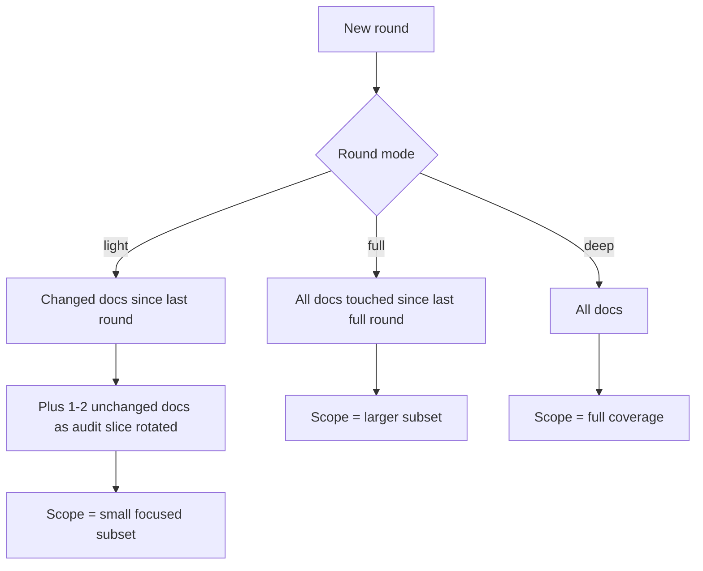

# change-aware-scoping

Default scope is docs changed since last round plus a small audit slice of unchanged docs. Full-coverage rounds run periodically.

## Why

Most rounds review docs that have not changed. Token spend without finding signal. Re-running the same review on unchanged content is waste.

## Audit slice

Even in light mode, include 1-2 unchanged docs rotated each round as a sanity audit slice. Catches drift in stable docs and prevents stale areas from going dark.

## Periodic full coverage

Regardless of changes, run a full-coverage round every Nth round (e.g., 10). Cross-cutting issues that only show with full picture surface here.

## Tracking

Loop driver tracks per round which docs were in scope. Recurrence index gains a "scope coverage" dimension to detect any doc that has not been reviewed in N rounds — flag for next round.
