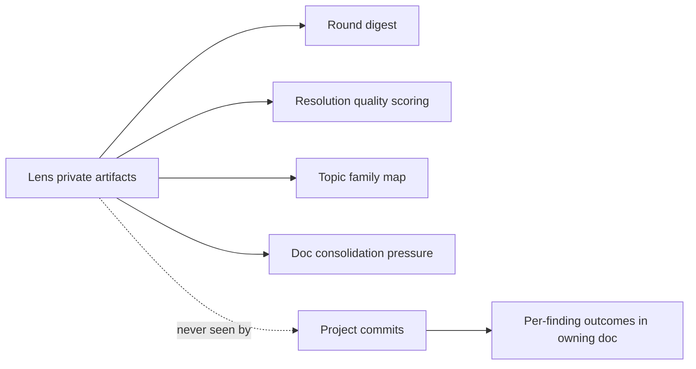

# convergence

Loop-driver-only artifacts that accelerate convergence across rounds. Private to lens; never in the project repo or visible to reviewers.

## Round digest

After each round, write a private summary covering: findings resolved, root causes addressed, pre-emptive sweeps applied, topic families touched, forward-expanded non-goals added, doc-clarity signals (resolutions likely to be re-raised), predicted topics for next round. Stored in the project's logs subdirectory inside lens. Drives next round's persona / scope / theme / stress-test picks.

## Resolution quality scoring

Per resolution, track survival across subsequent rounds:
- **High**: zero re-raises across 3+ rounds
- **Medium**: one re-raise resolved by tightening doc text
- **Low**: re-raised in same form despite explicit non-goal — doc clarity failure

Low triggers a doc rewrite of that section, never a re-debate.

## Doc consolidation pressure

Docs that cross-reference each other ≥3 times across rounds are merge candidates. Loop driver inspects, decides, applies when merge improves clarity. Reduces SSOT drift surface.

## Topic family map

Per-project clusters of related concern topics. Updated as topic clusters emerge. Feeds action propagation (family-level neighbors), recurrence-index cluster detection, and round planning (cover under-tested families).
