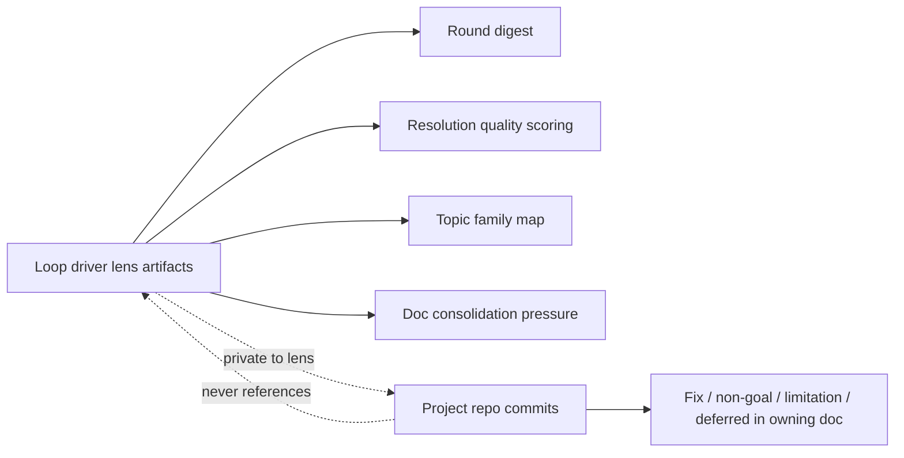

# convergence

Loop-driver-only artifacts that accelerate convergence across rounds. Internal to lens; not visible to reviewers or in project commits.

## Round-output digest

After every round, generate a private summary covering:
- Findings confirmed and resolved
- Root cause(s) addressed
- Pre-emptive sweeps applied
- Topic families touched
- Forward-expanded non-goals added
- Doc-clarity signal (any resolution that's likely to be re-raised due to weak text)
- Predicted topics for next round

Stored in the project's logs subdirectory inside lens. Not in the project repo.

Drives next round's planning: persona, scope, theme, stress-tests are picked partly based on the digest.

## Resolution quality scoring

Track per resolution: did it survive N subsequent rounds without re-raise? Score:
- High: zero re-raises across 3+ rounds
- Medium: one re-raise that was resolved by tightening doc text
- Low: re-raised in same form despite explicit non-goal — doc clarity failure

Low-score resolutions trigger a doc rewrite of that section, not a re-debate of the concern.

## Doc consolidation pressure

Periodic loop-driver check: docs that frequently cross-reference each other (≥3 cross-citations across rounds) are candidates for merge. Reduces SSOT drift surface and shortens reviewer reading paths.

Not automatic. Loop driver inspects, decides, applies if merge improves clarity.

## Topic family map

Maintained per project in lens. Groups recurring concern topics into families. Updated as topic clusters emerge from rounds.

Used by:
- Action propagation (topic family neighbors)
- Recurrence index (cluster-level recurrence detection)
- Round planning (cover under-tested families more often)

## Loop-driver vs project boundary

These artifacts compound across rounds. They are why convergence accelerates over time even though every round looks identical to the reviewer.
