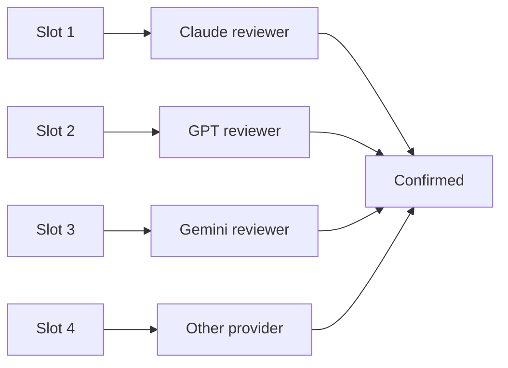

# cross-provider

Same model family shares blind spots. Cross-provider reviewers catch what one family alone misses.

## Pairing rule

Per parallel round, distribute slots across providers. No two slots same provider unless slot count exceeds provider count. Auditors should be a different provider than the primary they audit when possible — cross-provider audit catches family-shared fabrication patterns.

## Bias log

Track per provider: total findings, fabrication-risk rate, severity distribution, audit pass rate. Provider with high fabrication rate gets fewer slots next round. Provider with high audit-pass rate plus high finding count is favored.

## Termination dependence

Termination requires "No concerns" verdicts across at least two providers in the relevant scope, not just one provider repeatedly. Single-provider "No concerns" does not terminate.
