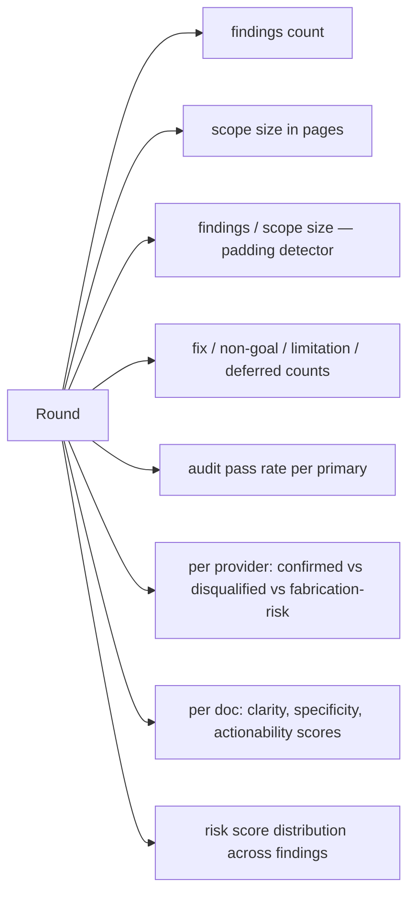

# empirical-signal

Numeric tracking per round. Trends over rounds reveal whether the loop is converging or stalling.

## Per-round metrics

## What each signal tells you

- **Findings/scope ratio** rising over rounds → reviewers padding, tighten disqualifiers
- **Outcome distribution** dominated by non-goals → project committing to its disagreements (could be rigid or could be a strong stance)
- **Outcome distribution** dominated by fixes deep into the loop → docs not converging
- **Audit pass rate** falling → primaries gaming the format; recalibrate
- **Provider bias** asymmetric → use lower-bias providers more; rotate or de-weight high-bias
- **Doc scores** trending up → real convergence
- **Risk distribution** shifting toward lower tiers → hardest findings already addressed

## Storage

Per project per round in the project's logs file inside the lens repo. Numeric values in a structured block per round.

## Action triggers

- Padding ratio trend up for 2 rounds → tighten brief disqualifiers
- Fixes dominate after round 5 → doc clarity issue, schedule meta-review
- One provider audit-pass drops below threshold → reduce its slot count next round
- One doc consistently scores lowest for 3 rounds → rewrite that doc, do not just patch
