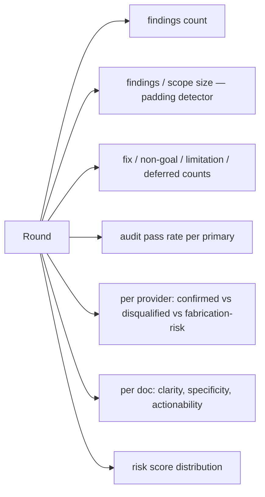

# empirical-signal

Per-round numeric tracking. Trends across rounds tell whether the loop converges or stalls.

## Metrics

## Reading

- Padding ratio rising → tighten disqualifiers in brief.
- Non-goals dominate → project committing to disagreements (rigid or principled).
- Fixes dominate late in loop → docs not converging.
- Audit pass rate falling → primaries gaming format; recalibrate.
- Provider bias asymmetric → reduce slots for high-bias provider.
- Doc scores trending up → real convergence.
- Risk distribution skewing low → hardest findings addressed.

## Storage

Per project per round inside lens logs.

## Action triggers

- Padding ratio up for 2 rounds → tighten brief.
- Fixes dominate after round 5 → schedule meta-review.
- Provider audit-pass below threshold → reduce its slots next round.
- One doc consistently lowest score for 3 rounds → rewrite, not patch.
