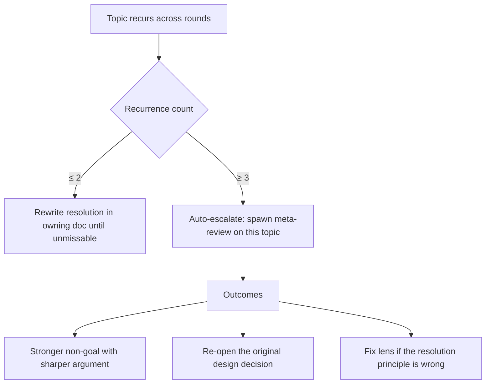

# escalation

## Why

Three recurrences despite prior resolutions means one of: the resolution principle is wrong, the doc text is unclear, or lens has a structural gap. Auto-escalation prevents wasted rounds.

## Procedure

1. Detect recurrence ≥ 3 for a topic.
2. Spawn meta-reviewer focused only on that topic's resolution path across rounds.
3. Apply outcome with action discipline.
4. Reset counter for the topic.

## Counter rules

Successful resolution clears the counter. New genuine recurrence after reset starts at one. Counter is per topic per project, not global.
