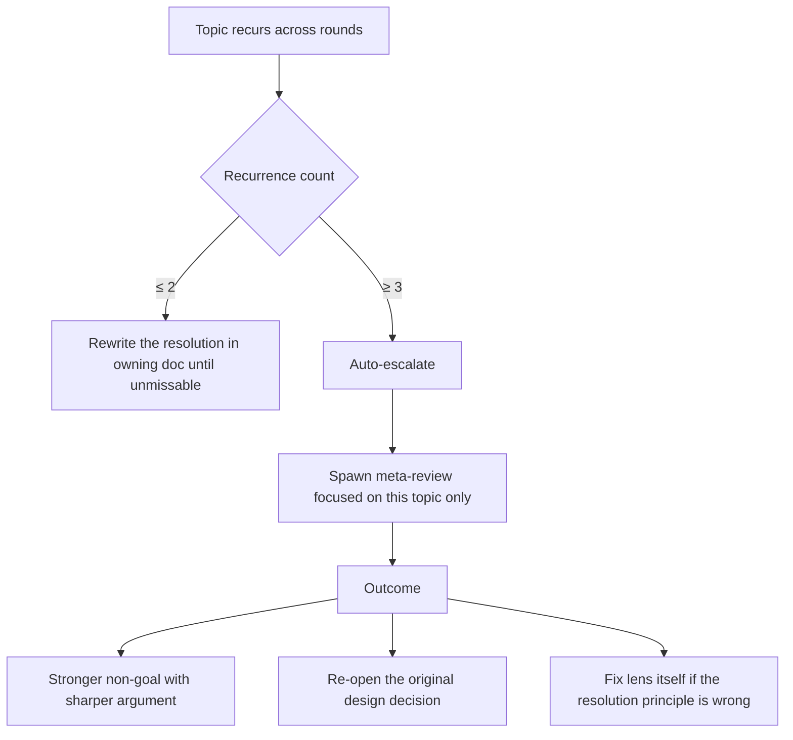

# escalation

Recurrence-triggered auto-escalation. The recurrence index becomes actionable.

## Trigger

## Why

If a topic recurs three times despite each prior resolution, one of three things is true:
- The resolution principle itself is wrong (project should change the decision)
- The resolution text in the doc is unclear (rewrite for clarity)
- The lens process has a structural gap that allows this re-raise (fix lens)

Without auto-escalation, the loop wastes rounds on the same concern indefinitely.

## Procedure

1. Detect recurrence ≥ 3 in the recurrence index for one topic.
2. Spawn a meta-reviewer focused only on that topic's resolution path across rounds.
3. Meta-reviewer outputs which of the three outcomes applies.
4. Apply the outcome with action discipline (fix / non-goal / limitation / deferred).
5. Reset the recurrence counter for that topic.

## Counter reset rules

- Successful resolution clears counter
- New genuine recurrence after the reset starts at one
- Recurrence counter is per topic per project, not global
