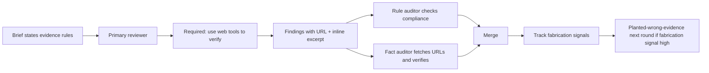

# fact-discipline

Process for keeping reviewer findings backed by real evidence so verification by the loop driver shrinks toward zero.

## Layered enforcement

- Brief mandates verifiable inline evidence per finding.
- Primary uses web tools at review time; tool calls logged.
- Two-auditor pass per primary: rules + facts.
- Fact auditor fetches every URL.
- Fabrication-risk findings exclude persona+model combination next round.
- Calibration probes occasionally plant deliberately wrong evidence to test fact-discipline directly.

## Failure modes the layers catch

| Failure mode | Layer that catches it |
|---|---|
| Reviewer guesses without verifying | Brief evidence rules + auditor checks excerpt presence |
| Reviewer fabricates URL | Fact auditor's URL fetch |
| URL is real but does not support claim | Fact auditor's excerpt verification |
| Reviewer cites correct source but wrong line | Pinpoint citation rule + fact auditor |
| Reviewer extrapolates beyond cited evidence | Generalization rule + auditor |
| Reviewer's model lacks priors for scope | Domain-knowledge probe + planted-wrong-evidence probe |

## Outcome budget

A round is healthy when:
- Fact-confirmed rate above 90%
- Fabrication-risk rate below 5%
- Tool-use telemetry shows primary actually called web tools when external claims were made

Rates outside these bands trigger:
- Persona+model exclusion for next round
- Brief tightening if pattern persists
- Meta-review escalation if pattern persists across multiple rounds

## Loop driver responsibility

Loop driver does not personally fact-check findings. Loop driver inspects the merge output (findings that survived both auditors). Verification work is consumed by the auditor pass; loop driver only audits the auditors via meta-review periodically.

This is the path to near-zero personal verification.
