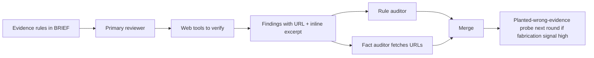

# fact-discipline

Layered enforcement keeps reviewer findings backed by real evidence so loop-driver verification shrinks toward zero.

## Failure mode → catching layer

| Failure | Layer |
|---|---|
| Guesses without verifying | Brief rules + auditor excerpt check |
| Fabricates URL | Fact auditor URL fetch |
| Real URL but doesn't support claim | Fact auditor excerpt verification |
| Correct source, wrong line | Pinpoint-citation rule + fact auditor |
| Extrapolates beyond cited evidence | Generalization rule + auditor |
| Model lacks priors for scope | Domain-knowledge + planted-wrong-evidence probes |

## Healthy round

- Fact-confirmed rate above 90%
- Fabrication-risk rate below 5%
- Tool-use telemetry shows primary called web tools when external claims were made

Out-of-band triggers persona+model exclusion next round, brief tightening if persistent, meta-review escalation if persistent across multiple rounds.

## Loop driver

Does not personally fact-check. Inspects merge output (findings that survived both auditors). Verification consumed by auditor pass. Loop driver only audits the auditors via periodic meta-review.
