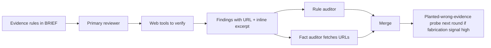
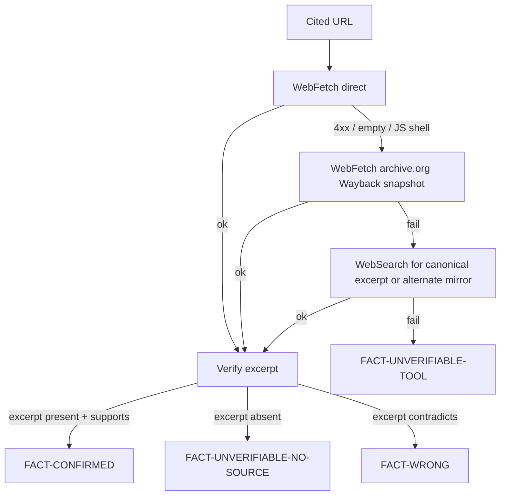

# fact-discipline

Layered enforcement keeps reviewer findings backed by real evidence so loop-driver verification shrinks toward zero.

## Failure mode → catching layer

| Failure | Layer |
|---|---|
| Guesses without verifying | Brief rules + auditor excerpt check |
| Fabricates URL | Fact auditor URL fetch |
| Real URL but doesn't support claim | Fact auditor excerpt verification |
| Correct source, wrong line | Pinpoint-citation rule + fact auditor |
| Extrapolates beyond cited evidence | Generalization rule + auditor |
| Model lacks priors for scope | Domain-knowledge + planted-wrong-evidence probes |
| Auditor tool can't render JS-heavy source | Fallback ladder (Wayback + alt-mirror search) before declaring unverifiable |

## Healthy round

- Fact-confirmed rate above 90%
- Fabrication-risk rate below 5%
- Tool-use telemetry shows primary called web tools when external claims were made

Out-of-band triggers persona+model exclusion next round, brief tightening if persistent, meta-review escalation if persistent across multiple rounds.

## Tooling limit: WebFetch can't read JS-rendered pages

Many vendor docs (Apple Developer, AWS, Auth0, Apollo, Stripe blog) ship as JS-hydrated shells. Static fetch returns empty, 200-with-title-only, or 4xx. That is a fact-auditor tool limit, not reviewer fabrication. Distinguishing the two is mandatory.

## Fact-auditor fallback ladder

Before declaring a verdict, the fact auditor walks this ladder per URL:

## Verdict taxonomy

- **FACT-CONFIRMED**: source fetched, excerpt verified, supports claim.
- **FACT-WRONG**: source fetched, excerpt absent or contradicted by surrounding context. Reviewer fabrication. Drop the finding; flag persona+model.
- **FACT-UNVERIFIABLE-NO-SOURCE**: ladder exhausted, no fetch found the excerpt anywhere. Treat as suspected fabrication. Drop the finding; flag persona+model.
- **FACT-UNVERIFIABLE-TOOL**: ladder exhausted because every fetch returned tool-shape failure (4xx, JS shell, empty body) without ever delivering source content. Tooling limit, not finding fault. **Do not drop the finding.** Mark for one-time manual loop-driver verification before merge; if the loop driver confirms by reading the source through a browser-equivalent path, treat as FACT-CONFIRMED for this round only and log under tool-limit-bias for the round.

## Merge rule update

A finding merges into the round's confirmed set only if rule auditor returns CONFIRMED AND fact auditor returns FACT-CONFIRMED (or finding has no external claims, or every external claim is FACT-UNVERIFIABLE-TOOL with loop-driver manual verification recorded).

FACT-WRONG and FACT-UNVERIFIABLE-NO-SOURCE drop the finding and mark the persona+model in provider-bias for next round.

## Loop driver

Does not personally fact-check during normal flow. Inspects merge output (findings that survived both auditors). Verification consumed by auditor pass.

**Exception**: when a finding's external claim returns FACT-UNVERIFIABLE-TOOL after the auditor walked the full ladder, the loop driver does a one-time manual fetch (or browser-rendered read) before merging that single finding. This is not a general fact-check; it is a tool-failure backstop for that one URL. Record the manual verification in the round log.

Loop driver audits the auditors via periodic meta-review.
