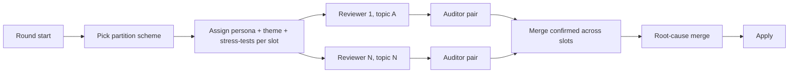

# parallel-coverage

Partition schemes in [partitions](../libraries/partitions.md). Auditor pair = rule + fact, see [AUDIT](../AUDIT.md).

## Rules

- Disjoint scope per primary; each owns a non-overlapping slice.
- Auditor verifies primary stayed in slice; out-of-slice findings dropped.
- Cross-cutting docs (PHILOSOPHY, README, GLOSSARY) referenced by all but owned by exactly one per round; ownership rotates.
- Slot count uncapped; constraint is meaningful disjoint scope per slot. Splitting a doc across slots forbidden.
- Different providers across slots in the same round (see [cross-provider](cross-provider.md)).
- One slot every round is the [adversarial full-context peer](adversarial-full-context-peer.md), auditor-paired like any primary.
