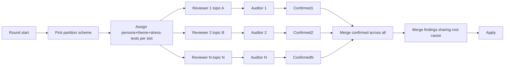

# parallel-coverage

Parallel non-overlapping reviewers cover the doc surface in one round.

## No-overlap enforcement

- Loop driver assigns disjoint scope per primary
- Auditor verifies the primary did not raise findings about docs outside its slice
- Findings outside slice are dropped on audit (not the primary's owned scope)

## Cross-cutting docs

Some docs (PHILOSOPHY, README, GLOSSARY) are referenced by every reviewer but owned for review by exactly one. Owner of a cross-cutting doc is rotated each round.

## Slot count

No fixed cap. Use as many slots as the partition scheme produces. Constraint: each slot must have a meaningful disjoint scope. Splitting a doc across slots is forbidden.

## Provider mix

If multiple model providers are available (Claude, GPT, Gemini, etc), assign different providers to different slots in a round. Cross-provider blind-spot reduction. See cross-provider.md.
