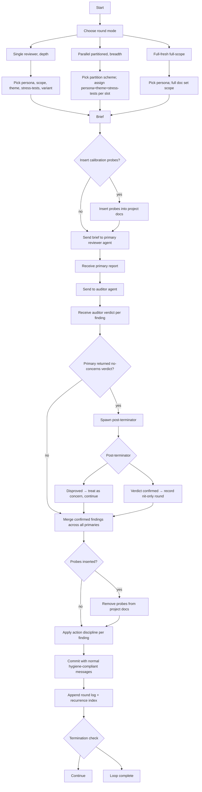

# round-flow

End-to-end flow for one review round.

## Brief composition checklist

Before sending any brief:
- Persona filled in
- Scope filled in
- Theme filled in
- Stress-tests filled in (2-3)
- Variant chosen (plain / steel-man-first / adversarial-framing)
- No mention of prior rounds anywhere in brief
- No mention of looping anywhere in brief
- Doc paths in scope are accessible to the reviewer agent

## Auditor coupling

Every primary reviewer in a round is paired one-to-one with an auditor. Auditor receives only:
- The primary's full report
- Read-only access to the same scope of project docs the primary reviewed

Auditor does not receive any other reviewer's report. Auditor does not receive the brief that produced the primary report.

## Probe handling

If probes were inserted:
- Insertion happens after writing the brief, before sending
- Removal happens after auditor verdict received, before merging
- Probe-related "findings" are stripped from the merged finding set
- Probe-catch result feeds into model-fitness signal, not project findings
