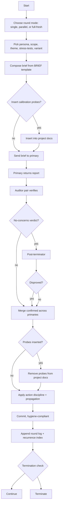

# round-flow

## Brief composition checklist

- Persona, scope, theme, stress-tests (2-3), variant filled
- No mention of prior rounds, looping, or fixes coming
- Doc paths accessible to the reviewer agent

## Auditor coupling

Every primary is paired with auditors per [AUDIT](../AUDIT.md). Auditor receives only the primary's report and read-only doc access for that scope. No other reviewer's report. No brief.

## Probe handling

Insert after brief composition, before send. Remove after auditor verdict, before merge. Probe-related findings stripped from merged set. Probe-catch outcome feeds model-fitness signal in [calibration-probes](../libraries/calibration-probes.md), not project findings.
