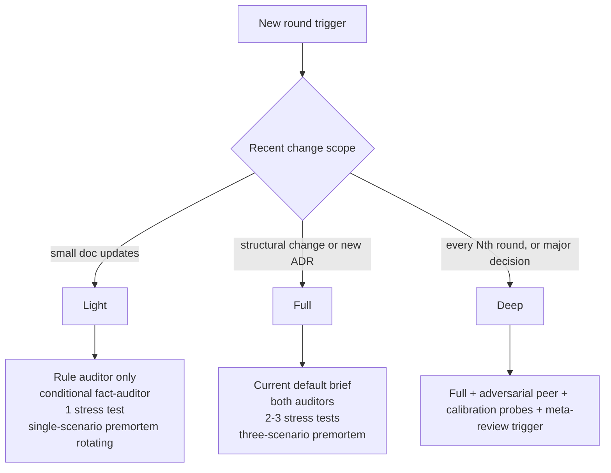
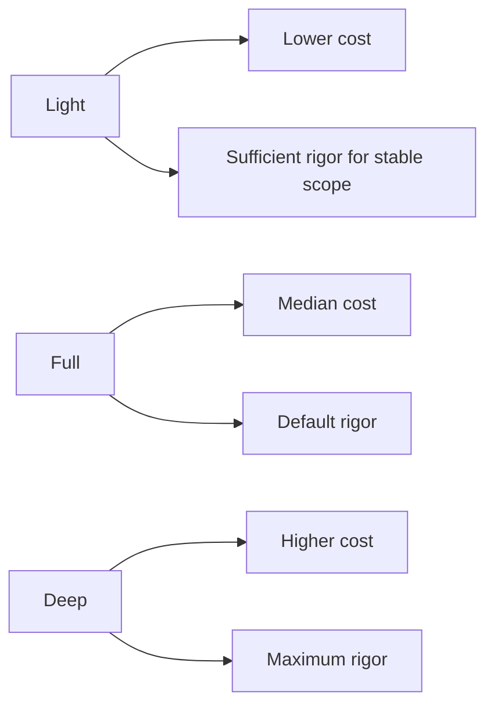

# round-modes

Three round tiers. Pick based on doc change scope and recent signal.

## Mode triggers

| Mode | Trigger |
|------|---------|
| Light | Doc-style edits, small content changes, single ADR added, day-to-day cleanup |
| Full | Structural change, new architecture decision, philosophy update, scope expansion |
| Deep | Periodic (every Nth round, e.g., 5), or major design pivot, or recurrence-triggered escalation |

## What each mode includes

- **Light**: BRIEF phases 1-5 plus terminator phase. Rule auditor every primary. Fact auditor only when finding has external claims. One stress test. Single-scenario premortem rotating across rounds (technical → business → regulatory).
- **Full**: BRIEF phases 1-13. Both auditors per primary. Two-three stress tests. Three-scenario premortem. Adversarial peer optional but not required.
- **Deep**: Full plus adversarial full-context peer plus calibration probes inserted plus meta-review of strategy itself afterward.

## Cost vs rigor

Light is the default for unchanged or lightly-changed scope. Full when something architectural shifts. Deep on cadence.

## Termination interaction

Termination requires recent rounds at Full or Deep mode minimum. Light-only rounds do not advance the terminator counter alone; one Full or Deep round must confirm the nit-only state.
