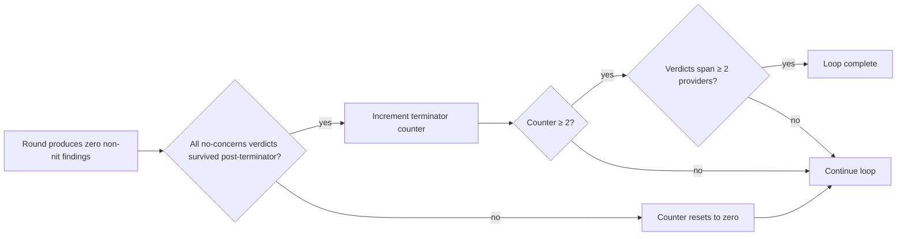

# termination

When the loop on a project stops.

## Signal

## Conditions for termination

All required:
- Two consecutive rounds produce only no-concerns or only nit-level findings
- At least one of the two terminating rounds is full or deep mode
- Each no-concerns verdict in those rounds survived its post-terminator pass
- Verdicts span at least two model providers
- Most recent calibration probe was caught by reviewers — model is competent
- Cost-per-confirmed-finding for the last two rounds exceeds a threshold (diminishing returns explicit)

If any condition fails, counter resets and loop continues.

## After termination

The doc set is declared self-defending for the current scope.

If scope is later extended (new ADRs, new features, new docs), termination must be re-earned for the new scope.

Termination is not permanent. Periodic verification rounds (e.g., quarterly) re-test the doc set against fresh reviewers. If new concerns surface, loop resumes.
