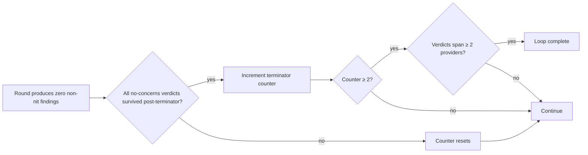

# termination

## Conditions

All required:
- Two consecutive rounds produce only no-concerns or only nits
- Each no-concerns verdict survived [post-terminator](../POST-TERMINATOR.md)
- Verdicts span at least two model providers
- Most recent calibration probe caught — reviewer model is competent

Any failure resets counter.

## After termination

Doc set is declared self-defending for current scope. Scope extension (new ADRs, features, docs) re-earns termination. Periodic verification rounds (e.g., quarterly) re-test against fresh reviewers; new concerns resume the loop.
